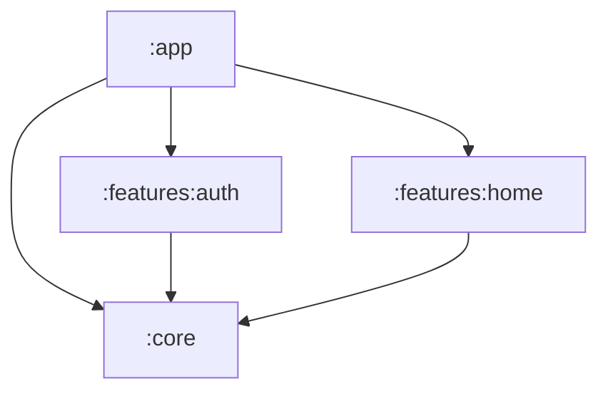

# Modularity System Design & Feature Module Creation

Revibes is structured as a highly modularized Android application to encourage clean separation of concerns, build speed improvements, and developer autonomy.

---

## 1. Modularity Architecture

The project has three main layers of modularization:
- **`:app` module**: The main application runner. Handles launching the entry activity (`MainActivity`), hosting the main Compose Destintations navigation host, and tying all feature modules together.
- **`:core` module**: The central foundation module. Contains app-wide services, local storage wrapper (`LocalDataSource`), network creator (`KtorfitCreator`), dependency injection configurations, and global presentation components (themes, typography, base ViewModels, common helpers).
- **`:features` modules**: Specialized horizontal modules focused on cohesive user actions (e.g., `:features:auth`, `:features:home`, `:features:profile`). Each feature depends on `:core` but is decoupled from other features, routing navigation through an event bus.



---

## 2. Gradle Build Logic & Conventions

Modularity dependencies and settings are standardized through Gradle build logic convention plugins:
- Located in the **`sjy-build-logic`** included build.
- Dependencies are referenced using the custom **`sjy`** version catalog defined in `settings.gradle.kts` pointing to `sjy-build-logic/gradle/libs.versions.toml`.

### Precompiled Script Plugins
Standard plugins applied to modules:
- `alias(sjy.plugins.buildlogic.lib)` — Configures basic Android library parameters (MinSDK, TargetSDK, Kotlin version).
- `alias(sjy.plugins.buildlogic.compose)` — Configures Compose compiler, dependencies, and settings.
- `alias(sjy.plugins.buildlogic.firebase)` — Includes Firebase BOM and standard plugins.
- `alias(sjy.plugins.buildlogic.detekt)` — Applies static analysis and formatting rules.

---

## 3. Guide: Creating a New Feature Module

To add a new feature module called `:features:example`, follow this step-by-step checklist:

### Step 1: Create the Module Directory
Create the folder structure:
```bash
features/example/
├── src/main/
│   ├── java/com/carissa/revibes/example/
│   │   ├── data/
│   │   ├── domain/
│   │   └── presentation/
│   ├── res/
│   └── AndroidManifest.xml
├── build.gradle.kts
├── consumer-rules.pro
└── proguard-rules.pro
```

### Step 2: Define `build.gradle.kts`
Write the Gradle config applying convention plugins:
```kotlin
plugins {
    alias(sjy.plugins.buildlogic.lib)
    alias(sjy.plugins.buildlogic.compose)
    alias(sjy.plugins.buildlogic.detekt)
}

android {
    namespace = "com.carissa.revibes.example"
    defaultConfig {
        testInstrumentationRunner = "androidx.test.runner.AndroidJUnitRunner"
        consumerProguardFiles("consumer-rules.pro")
    }
}

dependencies {
    implementation(project(":core"))
}
```

### Step 3: Register the Module
Add the module in `settings.gradle.kts`:
```kotlin
include(":features:example")
```

And add it as a dependency to `:app` in `app/build.gradle.kts`:
```kotlin
dependencies {
    implementation(project(":core"))
    implementation(project(":features:example"))
    // Other features...
}
```

### Step 4: Create Koin Module
Create a Koin module class with compile-time annotations to automatically scan dependencies in the new feature packages:
```kotlin
package com.carissa.revibes.example

import org.koin.core.annotation.ComponentScan
import org.koin.core.annotation.Module

@Module
@ComponentScan(
    "com.carissa.revibes.example.data",
    "com.carissa.revibes.example.domain",
    "com.carissa.revibes.example.presentation"
)
object ExampleModule
```

### Step 5: Configure App Startup Initializer
Write an `androidx.startup.Initializer` to automatically load the Koin modules during application startup:
```kotlin
package com.carissa.revibes.example

import android.content.Context
import androidx.startup.Initializer
import com.carissa.revibes.core.di.KoinInitializer
import org.koin.core.context.loadKoinModules

class ExampleModuleInitializer : Initializer<Unit> {
    override fun create(context: Context) {
        loadKoinModules(ExampleModule.module())
    }

    override fun dependencies(): List<Class<out Initializer<*>?>?> {
        return listOf(KoinInitializer::class.java)
    }
}
```

Register this startup initializer in `features/example/src/main/AndroidManifest.xml`:
```xml
<?xml version="1.0" encoding="utf-8"?>
<manifest xmlns:android="http://schemas.android.com/apk/res/android"
    xmlns:tools="http://schemas.android.com/tools">

    <application>
        <provider
            android:name="androidx.startup.InitializationProvider"
            android:authorities="${applicationId}.androidx-startup"
            android:exported="false"
            tools:node="merge">
            <meta-data
                android:name="com.carissa.revibes.example.ExampleModuleInitializer"
                android:value="androidx.startup" />
        </provider>
    </application>
</manifest>
```
