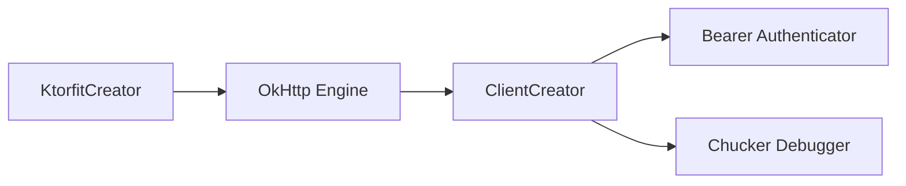

# Networking System Architecture (Ktorfit & OkHttp)

Revibes relies on **Ktorfit** (a Kotlin Multiplatform HTTP client generator utilizing Ktor) combined with a preconfigured **OkHttp** engine on Android for handling networking requests.

---

## 1. Network Component Architecture

The network client is split into modular creators managed via Koin DI:
- **`KtorfitCreator`**: Configures Ktor with content negotiation (JSON serialization), logging capabilities, base URL, and wraps it around an OkHttp client engine.
- **`ClientCreator`**: Instantiates the underlying `OkHttpClient` with custom interceptors, connection pools, and caching rules.
- **`Authenticator`**: Intercepts requests to inject `Bearer $token` authorization headers.



### OkHttp Client Settings
- **Connection Failure Retry**: Disabled (`retryOnConnectionFailure(false)`) to prevent duplicate payloads on unstable connections.
- **Protocols**: Supports `Protocol.HTTP_2` and `Protocol.HTTP_1_1`.
- **Connection Pool**: 16 max idle connections, 6-minute keep-alive.
- **Caching**: Inject cache-control headers on network requests.

---

## 2. Bearer Authentication Interceptor

The `Authenticator` interceptor injects the Bearer auth token fetched from `AuthTokenDataSource` if it is not already present:

```kotlin
@Single
internal class Authenticator(
    private val authTokenDataSource: AuthTokenDataSource
) : Interceptor {
    override fun intercept(chain: Interceptor.Chain): Response {
        val request = chain.request()
        val authToken = authTokenDataSource.getAuthToken()
        if (!request.headers["Authorization"].isNullOrBlank() || authToken.isNullOrBlank()) {
            return chain.proceed(request)
        }
        val newRequest = chain.request().newBuilder()
            .addHeader("Authorization", "Bearer $authToken")
            .build()
        return chain.proceed(newRequest)
    }
}
```

---

## 3. Repositories & Exception Handling

All repository network requests must extend **`BaseRepository`** to leverage unified error handling:

### `KtorfitCreator` Configuration
To prevent raw unintercepted `ClientRequestException` crashes, `KtorfitCreator` sets `expectSuccess = false` and uses an `HttpResponseValidator` to catch non-2xx responses and throw `ResponseException`.

### `BaseRepository` Execution Wrapper
`BaseRepository` provides an `execute` function that:
1. Runs code on `appDispatchers.io` thread context.
2. Catches `ResponseException` and `ApiException`.
3. Parses error JSON payloads into `ApiException` with `message` field support and intelligent `displayMessage` fallback humanization (e.g. `message.ifBlank { reasons.firstOrNull() ?: humanizeErrorCode(error) }`).
4. Triggers `TokenExpiredUseCase` on 401 Unauthorized response to clear session state.

```kotlin
abstract class BaseRepository(
    private val shouldKickWhenAuthFailed: Boolean = true,
    ...
) {
    protected suspend fun <T> execute(block: suspend () -> T): T {
        return withContext(appDispatchers.io) {
            try {
                block()
            } catch (e: ResponseException) {
                val statusCode = e.response.status.value
                val errorResponse = parseErrorResponse(e.response)
                if (shouldKickWhenAuthFailed && statusCode == 401) {
                    tokenExpiredUseCase()
                }
                throw ApiException(statusCode, errorResponse, e)
            } catch (e: Exception) {
                throw ApiException(-1, null, e)
            }
        }
    }
}
```


### Preserving Coroutine Cancellation
When catching exceptions or mapping results with `runCatching`, always propagate cancellation so coroutines cancel properly:
```kotlin
remoteConfigSource.runCatching {
    fetchAndActivate()
}
.rethrowCancellation() // Extension function ensuring CancellationException is rethrown
.onFailure {
    Log.d(TAG, "failed: $it")
}
```
