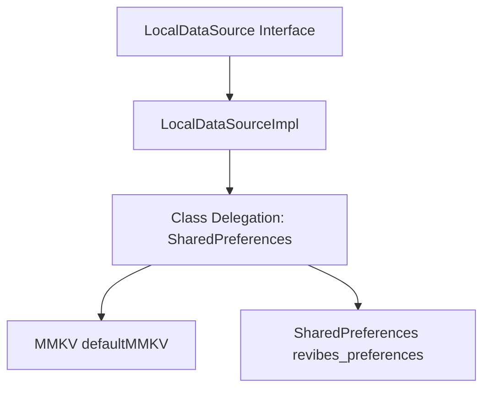

# Local Storage & Data Sources Architecture

Revibes implements a hybrid key-value local storage utilizing **MMKV** for high-performance operations, with an automatic fallback to private Android **SharedPreferences** on legacy or non-64-bit architectures.

---

## 1. LocalDataSource Architecture

The local storage system is abstracted behind the `LocalDataSource` interface which extends standard Android `SharedPreferences`.



### Architecture Detection & Initialization
During App Startup (`KoinInitializer`), the app verifies if the CPU architecture supports 64-bit binaries. If true, it initializes MMKV; otherwise, it falls back to standard SharedPreferences.

```kotlin
interface LocalDataSource : SharedPreferences {
    companion object {
        var isMMKVSuccesfullyInitialize = false

        private fun is64BitArchitecture(): Boolean {
            return Build.VERSION.SDK_INT >= Build.VERSION_CODES.LOLLIPOP &&
                   Build.SUPPORTED_64_BIT_ABIS.isNotEmpty()
        }

        fun maybeInitMMKV(context: Context) = runCatching {
            if (is64BitArchitecture()) {
                MMKV.initialize(context)
                isMMKVSuccesfullyInitialize = true
            }
        }.onFailure {
            isMMKVSuccesfullyInitialize = false
        }

        fun maybeUseMMKV(context: Context): SharedPreferences {
            return if (isMMKVSuccesfullyInitialize) MMKV.defaultMMKV()
                   else context.getSharedPreferences("revibes_preferences", Context.MODE_PRIVATE)
        }
    }
}
```

---

## 2. Interface & Class Delegation Pattern

To maintain clean architecture, domain-specific data sources delegate storage logic and separate Read/Write properties using Kotlin's **Class Delegation** (`by`) pattern.

### Separation of Read & Write Concerns (e.g., `UserDataSource`)
The `UserDataSource` interface decomposes Setter and Getter functionality into separate contracts:

```kotlin
interface UserDataSource : UserDataSourceSetter, UserDataSourceGetter {
    companion object {
        const val KEY = "user_data"
    }
}

@Single
internal class UserDataSourceImpl(
    private val localDataSource: LocalDataSource,
    private val json: Json
) : UserDataSource,
    UserDataSourceSetter by UserDataSourceSetterImpl(localDataSource, json),
    UserDataSourceGetter by UserDataSourceGetterImpl(localDataSource, json)
```

- **`UserDataSourceSetterImpl`**: Responsible for encoding custom models (`UserData`) to JSON strings and saving them.
- **`UserDataSourceGetterImpl`**: Responsible for reading the JSON string and decoding it back to type-safe models.

---

## 3. Data Source Implementation Rules

1. Always inject the abstract `LocalDataSource` interface rather than accessing MMKV/SharedPreferences directly.
2. Encrypt/decrypt credentials or sensitive user tokens.
3. For custom complex models, utilize Kotlinx Serialization (`Json.encodeToString`/`Json.decodeFromString`) to serialize values before storing.
