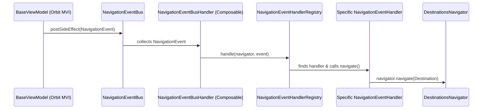

# Navigation System & Event Patterns

Reference sheet for Revibes navigation structure, Compose Destinations integration, and the event-driven routing pattern.

<pattern>
## Decoupled Navigation Pattern

Revibes separates navigation execution from the UI and presentation layer (ViewModels) using an event-driven bus system. 


</pattern>

<components>
## Core Architecture Components

### A. NavigationEvent
A simple marker interface for all navigation actions, defined in `:core`.
```kotlin
package com.carissa.revibes.core.presentation.navigation

interface NavigationEvent
```

### B. DestinationsNavigator Providers
`RevibesTheme` provides the navigation controller to the composition hierarchy via `LocalRevibesNavigator`. Access it anywhere in the composable tree using `RevibesTheme.navigator`.

```kotlin
private val LocalRevibesNavigator =
    compositionLocalOf<DestinationsNavigator> { error("No DestinationsNavigator provided") }

// Within RevibesTheme composable
LocalRevibesNavigator provides navController.rememberDestinationsNavigator()
```

### C. NavigationEventBusHandler
A top-level composable that listens to the `NavigationEventBus` and forwards events to the registry:
```kotlin
@Composable
fun NavigationEventBusHandler(
    navigator: DestinationsNavigator = RevibesTheme.navigator,
    eventBus: NavigationEventBus = koinInject(),
    navigationEventHandlerRegistry: NavigationEventHandlerRegistry = koinInject()
) {
    LaunchedEffect(Unit) {
        eventBus.collect {
            navigationEventHandlerRegistry.handle(navigator, it)
        }
    }
}
```

### D. NavigationEventHandlerRegistry
A factory class registered with Koin DI that holds all injected `NavigationEventHandler` implementations:
```kotlin
@Factory
class NavigationEventHandlerRegistry(
    private val handlers: List<NavigationEventHandler>
) {
    fun handle(navigator: DestinationsNavigator, event: NavigationEvent) {
        handlers.firstOrNull { it.canHandle(event) }?.navigate(navigator, event)
    }
}
```

### E. NavigationEventHandler Subclasses
Concrete handlers implement routing rules for specific feature domains:
```kotlin
abstract class NavigationEventHandler {
    abstract fun canHandle(event: NavigationEvent): Boolean
    abstract fun navigate(navigator: DestinationsNavigator, event: NavigationEvent)

    fun goToHome(navigator: DestinationsNavigator, popUpTo: Route = HomeScreenDestination) {
        navigator.navigate(HomeScreenDestination) {
            launchSingleTop = true
            restoreState = true
            popUpTo(popUpTo) { inclusive = true }
        }
    }
}
```
</components>

<guide>
## How to Implement a New Navigation Flow

1. **Define the Destination Screen**:
   Decorate the screen composable with `@Destination` (or `@Destination<SomeNavGraph>`).
   ```kotlin
   @Destination
   @Composable
   fun HelpCenterScreen(navigator: DestinationsNavigator) { ... }
   ```

2. **Define the Navigation Event**:
   Add a specific `NavigationEvent` representation:
   ```kotlin
   sealed interface HelpCenterNavigationEvent : NavigationEvent {
       object NavigateToFaq : HelpCenterNavigationEvent
       data class NavigateToTicketDetail(val ticketId: String) : HelpCenterNavigationEvent
   }
   ```

3. **Implement the Specific NavigationEventHandler**:
   Create a class extending `NavigationEventHandler` under the `presentation.navigation.handler` package:
   ```kotlin
   @Factory
   class HelpCenterScreenNavigationHandler : NavigationEventHandler() {
       override fun canHandle(event: NavigationEvent): Boolean = event is HelpCenterNavigationEvent

       override fun navigate(navigator: DestinationsNavigator, event: NavigationEvent) {
           when (val helpEvent = event as HelpCenterNavigationEvent) {
               is HelpCenterNavigationEvent.NavigateToFaq -> {
                   navigator.navigate(FaqScreenDestination)
               }
               is HelpCenterNavigationEvent.NavigateToTicketDetail -> {
                   navigator.navigate(TicketDetailScreenDestination(helpEvent.ticketId))
               }
           }
       }
   }
   ```

4. **Trigger Navigation from ViewModel**:
   Trigger the event via Orbit MVI `postSideEffect`:
   ```kotlin
   class HelpCenterViewModel : BaseViewModel<HelpCenterState, HelpCenterEvent>() {
       fun onFaqClicked() = intent {
           postSideEffect(HelpCenterNavigationEvent.NavigateToFaq)
       }
   }
   ```
</guide>
